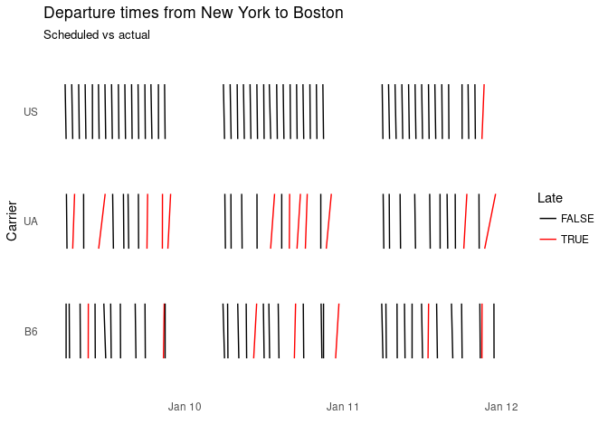

<!-- README.md is generated from README.Rmd. Please edit that file -->
ggdomino
========

> One damned thing after another

A geom for the 'ggplot2' package to visualize the difference between two events related to one object, e.g. scheduled and actual arrival.

Installation
------------

You can install ggdomino from github with:

``` r
# install.packages("devtools")
devtools::install_github("nacnudus/ggdomino")
```

Example
-------

``` r
library(ggplot2)
library(ggdomino)
example(geom_domino)
#> 
#> gm_dmn> # Plot a subset of the nycflights13 data
#> gm_dmn> library(ggplot2)
#> 
#> gm_dmn> ggplot(ggdomino::flights_example,
#> gm_dmn+          aes(sched_dep_time, carrier, xend = dep_time, colour = late)) +
#> gm_dmn+   geom_domino() +
#> gm_dmn+   scale_colour_manual("Late", values = c("black", "red")) +
#> gm_dmn+   xlab("") +
#> gm_dmn+   ylab("Carrier") +
#> gm_dmn+   ggtitle("Departure times from New York to Boston", sub = "Scheduled vs actual") +
#> gm_dmn+   theme_minimal() +
#> gm_dmn+   theme(panel.grid = element_blank())
```


