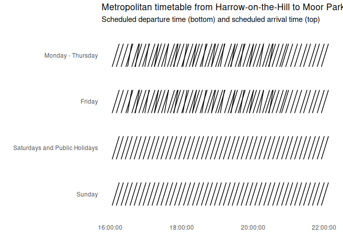

<!-- README.md is generated from README.Rmd. Please edit that file -->

# ggstraw

> One damned thing after another

A geom for the ‘ggplot2’ package to visualize the difference between two
events related to one object, e.g. scheduled and actual arrival.

## Installation

You can install ggstraw from github with:

``` r
# install.packages("devtools")
devtools::install_github("nacnudus/ggstraw")
```

## Example

``` r
library(ggplot2)
library(ggstraw)
example(geom_straw)
#> 
#> gm_str> # Plot a subset of the nycflights13 data
#> gm_str> library(ggplot2)
#> 
#> gm_str> ggplot(ggstraw::flights,
#> gm_str+        aes(sched_dep_time, carrier, xend = dep_time, colour = late)) +
#> gm_str+   geom_straw() +
#> gm_str+   scale_colour_manual("Late", values = c("black", "red")) +
#> gm_str+   xlab("") +
#> gm_str+   ylab("Carrier") +
#> gm_str+   ggtitle("Departure times from New York to Boston", sub = "Scheduled vs actual") +
#> gm_str+   theme_minimal() +
#> gm_str+   theme(panel.grid = element_blank())
```

<!-- -->

    #> 
    #> gm_str> # Plot a subset of the London Underground Metropolitan Line timetable
    #> gm_str> ggplot(ggstraw::timetable, aes(x = departure, xend = arrival, y = day)) +
    #> gm_str+   geom_straw() +
    #> gm_str+   xlab("") +
    #> gm_str+   ylab("") +
    #> gm_str+   ggtitle("Metropolitan timetable from Harrow-on-the-Hill to Moor Park",
    #> gm_str+   subtitle = "Scheduled departure time (bottom) and scheduled arrival time (top)") +
    #> gm_str+   theme_minimal() +
    #> gm_str+   theme(panel.grid = element_blank())

<!-- -->
